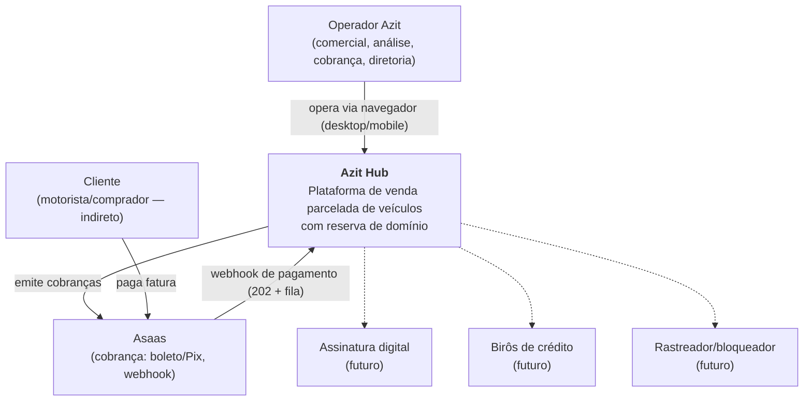
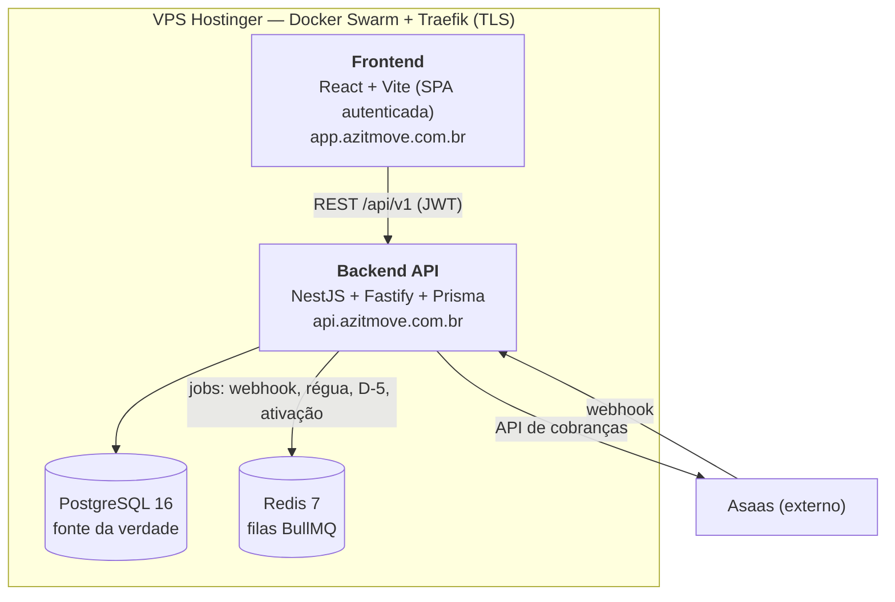
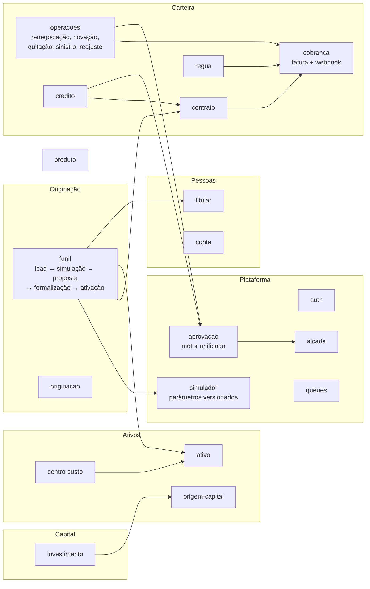

# C4 Model — Azit Hub

> Diagramas de arquitetura em três níveis (contexto, containers, componentes), conforme item 11 das "Definições Prévias". Renderizam no GitHub (mermaid). Atualizado em 14/07/2026.

## Nível 1 — Contexto do sistema

Princípio de fronteira: **Asaas executa, Azit controla** — toda lógica de negócio vive no Hub; integrações são executoras, nunca donas de regra. CRM e ERP completos serão integrações complementares futuras, sem aprisionar dados centrais.

## Nível 2 — Containers

Monorepo pnpm: `apps/backend`, `apps/frontend`, `packages/@azit/types` (enums compartilhados), `packages/@azit/utils` (cálculo financeiro puro, testado). Monolito modular — decisão validada em 13/07 (ADR-001).

## Nível 3 — Componentes do backend (módulos NestJS)

Convenções entre componentes: services conversam via injeção Nest; efetivadores registrados no motor de aprovação por registry (`onModuleInit`) para evitar dependência circular; enums mapeados na borda do service; leituras respeitam soft delete (`findFirst`).

## Integrações — estado

| Integração | Estado |
|---|---|
| Asaas (cobrança + conciliação) | **Operando** (webhook assíncrono, baixa automática) |
| Assinatura digital | Mapeada, aguardando escolha de fornecedor (ADR pendente) |
| Birôs de crédito | Aguardando política de crédito formalizada |
| Rastreador/bloqueio veicular | Futuro; avaliação de equipamento próprio em andamento |
| WhatsApp (régua) | Semi-integrado (registro no sistema; disparo externo) |
